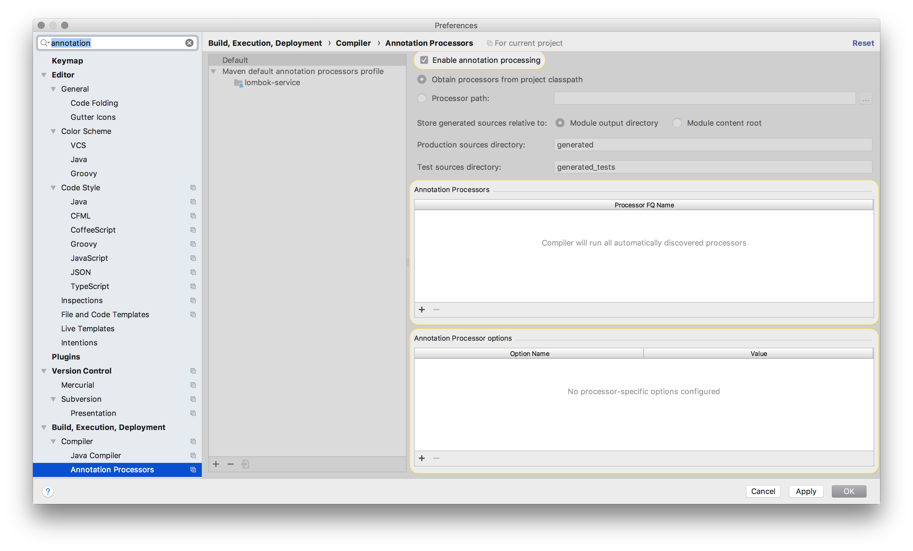
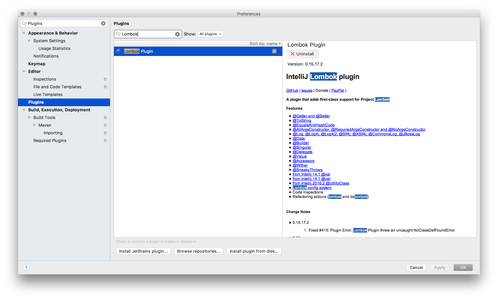

[](https://gitlab.qaware.de/qaware/qacampus/lombok-service/commits/master)

# Reducing Boilerplate Code with Project Lombok

This repository demonstrates the usage of Project Lombok to reduce common boilerplate code
of an ordinary Java EE 8 microservice application.

## Building and Running

```bash
$ ./mvnw clean package

$ docker build -t lombok-service:1.0 .
$ docker run -it -p 8080:8080 lombok-service:1.0 
```

## Using Project Lombok

### Step 1: Add the Lombok dependency

In the first step we need to add the Lombok dependency to our project to have the
Java annotation processor available.

For Maven, add the following dependency to your `pom.xml` file:
```xml
<dependencies>
    <dependency>
        <groupId>org.projectlombok</groupId>
        <artifactId>lombok</artifactId>
        <version>1.16.20</version>
        <scope>provided</scope>
    </dependency>
</dependencies>
```

In case you use Gradle as your build tool, add the following dependency to your `build.gradle` file:
```groovy
dependencies {
	compileOnly 'org.projectlombok:lombok:1.16.20'
}
```

When you use IntelliJ as your IDE, please make sure you have activated the Annotation
Processing for the project and install the Lombok plugin.






## Maintainer

Mario-Leander Reimer (@mario-leander.reimer), <mario-leander.reimer@qaware.de>

## License

This software is provided under the MIT open source license, read the `LICENSE.txt` 
file for details.