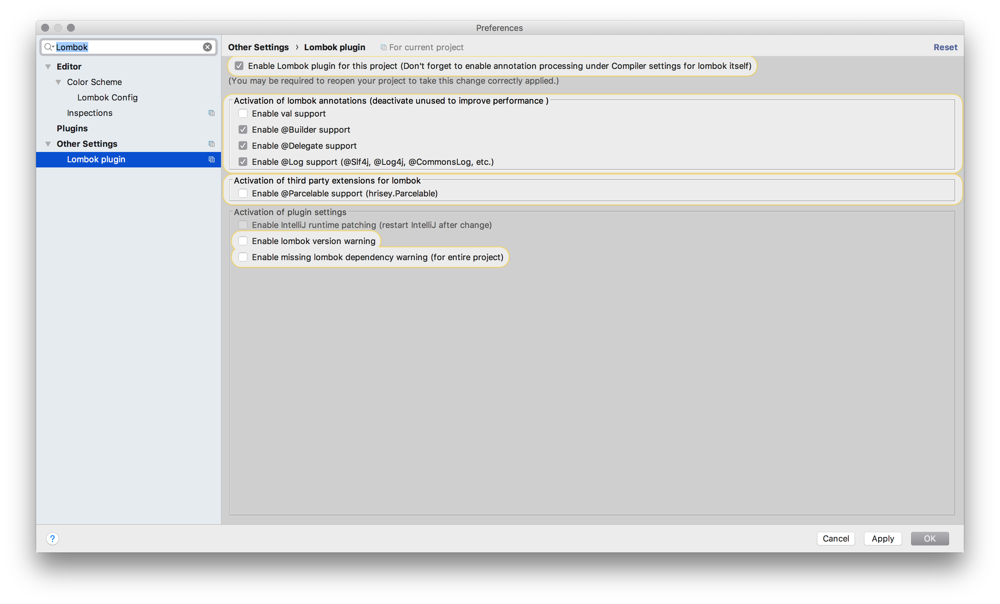

[](https://gitlab.qaware.de/qaware/qacampus/lombok-service/commits/master)

# Reducing Boilerplate Code with Project Lombok

This repository demonstrates the usage of Project Lombok to reduce common boilerplate code
of an ordinary Java EE 8 microservice application.

## Building and Running

```bash
$ ./mvnw clean package

$ docker build -t lombok-service:1.0 .
$ docker run -it -p 8080:8080 lombok-service:1.0 
```

## Using Project Lombok

### Step 1: Add the Lombok dependency

In the first step we need to add the Lombok dependency to our project to have the
Java annotation processor available.

For Maven, add the following dependency to your `pom.xml` file:
```xml
<dependencies>
    <dependency>
        <groupId>org.projectlombok</groupId>
        <artifactId>lombok</artifactId>
        <version>1.16.20</version>
        <scope>provided</scope>
    </dependency>
</dependencies>
```

In case you use Gradle as your build tool, add the following dependency to your `build.gradle` file:
```groovy
dependencies {
	compileOnly 'org.projectlombok:lombok:1.16.20'
}
```

When you use IntelliJ as your IDE, please make sure you have activated the Annotation
Processing for the project and install the Lombok plugin.





### Step 2: Reducing POJO boilerplate code with Lombok

There is a lot of boilerplate code in the `Feature` POJO, so let's refactor unsing Lombok.

#### @ToString

Instead of writing
```java
@Override
public String toString() {
    return "Feature{" + "name='" + name + '\'' +
            ", description='" + description + '\'' +
            ", stable=" + stable + '}';
}
```

add 
```java 
@ToString(doNotUseGetters = true)
``` 
to your class. Done.

#### @EqualsAndHashCode

Instead of writing
```java
@Override
public boolean equals(Object o) {
    if (this == o) {
        return true;
    }
    if (o == null || getClass() != o.getClass()) {
        return false;
    }

    Feature feature = (Feature) o;
    return stable == feature.stable &&
            Objects.equals(name, feature.name) &&
            Objects.equals(description, feature.description);
}

@Override
public int hashCode() {
    return Objects.hash(name, description, stable);
}
```

add 
```java 
@EqualsAndHashCode(doNotUseGetters = true)
``` 
to your class. Done.

#### @Getter and @Setter

And instead of writing those pescy getter and setter methods for your fields add
```java
@Getter
@Setter
```
to your class. Done.

#### @NoArgsConstructor and @AllArgsConstructor

Instead of writing
```java
/**
 * Package private default constructor.
 */
Feature() {
}

/**
 * Initialize a Feature with attributes.
 *
 * @param name        the feature name
 * @param description the description
 * @param stable      is feature stable
 */
public Feature(String name, String description, boolean stable) {
    this.name = name;
    this.description = description;
    this.stable = stable;
}
```

add 
```java 
@NoArgsConstructor(access = AccessLevel.PACKAGE)
@AllArgsConstructor
``` 
to your class. Done.

#### @Data

And instead of writing all the previous annotations
```java
@Getter
@Setter
@RequiredArgsConstructor
@ToString
@EqualsAndHashCode
``` 

add ```@Data``` to your class. Done.

#### @Builder

And you can add even more syntactic sugar such as a builder implementation
to construct instances using a fluent API.

So instead of writing
```java
Feature f = new Feature();
f.setName(name);
f.setDescription(description);
f.setStable(stable);
```

add ```@Builder``` and ```@Builder.Default``` to your class and fields and you can now write
```java
Feature f = Feature.builder().name(name).description(description).stable(stable).build();
```

### Step 3: Reducing CDI boilerplate code with Lombok

If you are using a DI framework such as CDI or Spring in combination with constructor injection
you also have to write some stupid boilerplate code: the constructors.

But instead of writing
```java
/**
 * Package private default constructor required by CDI.
 */
FeatureResource() {
}

/**
 * Initialize required dependencies via CDI with given attributes.
 *
 * @param repository the feature repository
 */
@Inject
public FeatureResource(final FeatureRepository repository) {
    this.repository = repository;
}
```

simply add   
```java 
@NoArgsConstructor(access = AccessLevel.PACKAGE)
@AllArgsConstructor(onConstructor = @__({@Inject}))
``` 
to your class. Done.

## Maintainer

Mario-Leander Reimer (@mario-leander.reimer), <mario-leander.reimer@qaware.de>

## License

This software is provided under the MIT open source license, read the `LICENSE.txt` 
file for details.